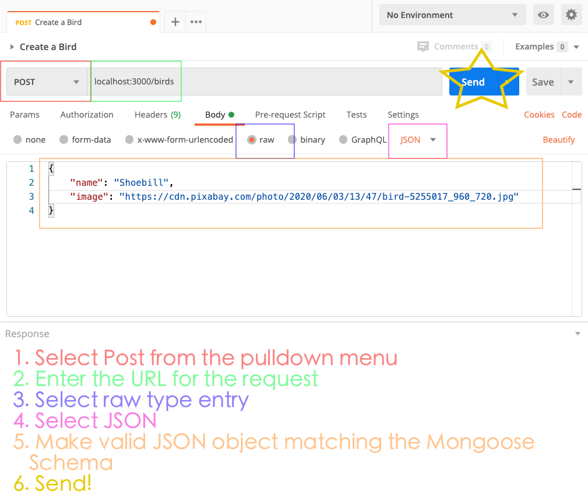

# Postman

Remember, browsers can only make get requests. In order to be able to make other requests like `POST`, `PUT` or `DELETE`, we'd need to render a form and build it out in order to test it.

Postman is an app that lets you test your APIs using a GUI. In the previous unit we used the command line cURL.

[download here](https://www.postman.com/downloads/)

Let's follow the docs:

[Postman Documentation](https://learning.postman.com/docs/sending-requests/requests/)




**SUCCESS**


## Read

**birds_controller.js**

```js
birds.get('/', (req, res) => {
  Bird.find({}, (err, foundBirds) => {
    res.json(foundBirds)
  })
})
```

**TEST**

- Select the New Button
- Request `Bird Index`
- Save to birds collection
- Make get request to `http:localhost:3000/birds`

We should get a simple string that says `index` - let's go to our controller and update it to return our birds

```js
birds.get('/', (req, res) => {
  Bird.find({}, (err, foundBirds) => {
    res.json(foundBirds)
  })
})
```

## Update

**birds_controller.js**

```js
birds.put('/:id', (req, res) => {
  Bird.findByIdAndUpdate(
    req.params.id,
    req.body,
    { new: true },
    (err, updatedBird) => {
      if (err) {
        res.send(err)
      } else {
        Bird.find({}, (err, foundBirds) => {
          res.json(foundBirds)
        })
      }
    }
  )
})
```

**TEST**

- Select New Button
- Request `Bird Update`
- Save to Birds Collection
- Choose Put from options
- Make request to `http:localhost:3000/birds` + an `_id` from your db, check the response area and copy an `_id` and paste it after `3000/`
- select `body`, `raw`, `json`
- update either the `img` or `name` field
- `send`
- check that your data updated correctly

## Delete

**birds_controller.js**

```js
birds.delete('/:id', (req, res) => {
  Bird.findByIdAndRemove(req.params.id, (err, deletedBird) => {
    Bird.find({}, (err, foundBirds) => {
      res.json(foundBirds)
    })
  })
})
```

**TEST**

- Select New Button
- Request `Bird Delete`
- Save to Birds Collection
- Choose Delete from options
- Make request to `http:localhost:3000/birds` + an `_id` from your db, check the response area and copy an `_id` and paste it after `3000/`
- `send`
- check that your data updated correctly

## EXTRA

### Add Seed Data

`touch models/bird_seed.js`

```js
module.exports = [
  {
    img:
      'https://cdn.pixabay.com/photo/2020/06/03/13/47/bird-5255017_960_720.jpg',
    name: 'Shoebill'
  },
  {
    img: 'https://i.imgur.com/20pjOv5b.jpg',
    name: 'Resplendent Quetzal'
  },
  { img: 'https://i.imgur.com/GacKN4tb.jpg', name: 'Royal Flycatcher' },
  { img: 'https://i.imgur.com/vHQizcwb.jpg', name: 'Turaco' },
  { img: 'https://i.imgur.com/VGAxKX1.png', name: 'tweetr' },
  { img: 'https://i.imgur.com/AAl3vspb.jpg', name: 'King Vulture' },
  {
    img: 'https://i.imgur.com/ZkvJHL8b.jpg',
    name: 'Frilled Coquette Hummingbird'
  },
  {
    img:
      'https://i.redditmedia.com/sl3adn3eXY65Y4yNLxMRO_O4y-Pf1EYCxPuHpV34WqI.jpg?fit=crop&crop=faces%2Centropy&arh=2&w=640&s=f461fa6cd525892f85eb89268550867a',
    name: 'Boat Billed Heron'
  },
  {
    img:
      'https://static.independent.co.uk/s3fs-public/thumbnails/image/2014/07/14/15/MPP.jpg?w968h681',
    name: 'Ex Parrot'
  }
]
```

**controllers/birds_controller.js**

```js
const birdSeed = require('../models/bird_seed.js')
```

```js
birds.get('/seed', (req, res) => {
  Bird.insertMany(birdSeed, (err, manyBirds) => {
    res.redirect('/')
  })
})
```

### Drop Collection

**controllers/birds_controller.js**

```js
birds.get('/dropcollection', (req, res) => {
  Bird.collection.drop()
  res.redirect('/')
})
```
